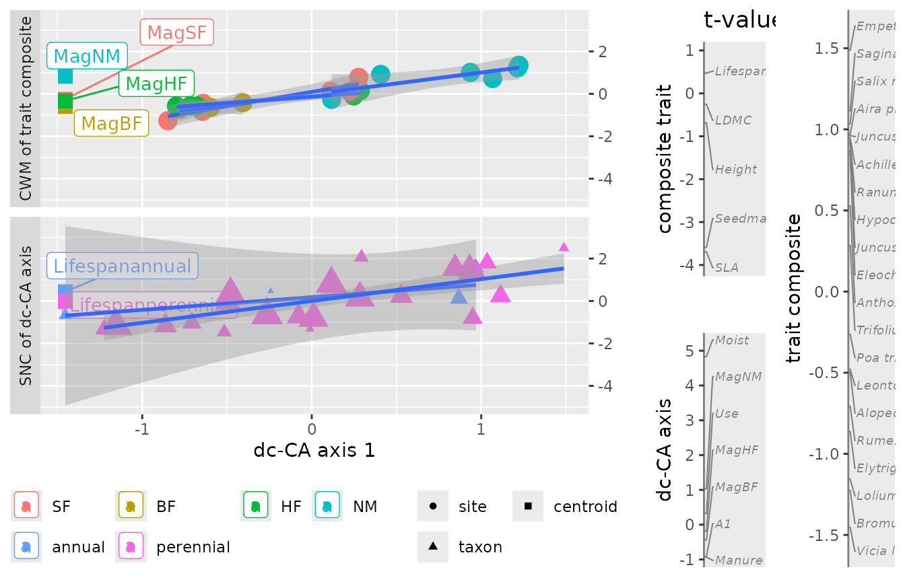

# douconca

``` r
library(douconca)
```

## The douconca package

The aim of the `douconca` package is to help ecologists unravel
trait-environment relationships from an abundance data table with
associated multi-trait and multi-environment data tables. A popular
method to such aim is RLQ ([Dolédec et al. 1996](#ref-doledec1996RLQ);
[Dray et al. 2014](#ref-dray2014RLQ)), which is also a three-tables
method. RLQ is available in the R-package `ade4` ([Dray and Dufour
2007](#ref-dray2007ade4); [Thioulouse et al.
2018](#ref-thioulouse2018multivariate)). The `douconca` package provides
an alternative method, termed double-constrained correspondence analysis
(dc-CA), which is a natural extension of the commonly used method of
community-weighted means (CWMs) regression ([ter Braak
2026](#ref-Braak2026); [ter Braak and van Rossum
2025](#ref-BraakRossum2025); [Ter Braak, Šmilauer, and Dray
2018](#ref-Braak2018dcCA); [Kleyer et al.
2012](#ref-kleyer2012assessing)).  
As dc-CA is based on both regression analysis and ordination (factorial
analysis), it allows for the usual forms of testing, model building, and
of biplots of resulting scores.

The value of dc-CA compared to RLQ, GLMM3 and CWM-regression is
discussed, with examples, in ter Braak and van Rossum (2025) and ter
Braak (2026).

The `douconca` package has a `formula`-interface to specify the dc-CA
model, and `scores`, `anova`, `plot` and `predict` functions, mostly
fairly similar to those in the `vegan` package ([Oksanen et al.
2024](#ref-oksanen_vegan2024)) on to which `douconca` is based. Because
of the `formula`-interface, names of trait and environmental variables,
and of levels of factors may need to be changed to syntactically valid
names, e.g. by `make.names` or `janitor::clean_names`. \# Double
constained correspondence analysis

As RLQ, dc-CA seeks for an ordination (i.e. a low-dimensional
representation of) of the multi-trait, multi-environment relationships,
but dc-CA differs from RLQ in that dc-CA is based on regression with the
traits and environmental variables as predictors, whereas RLQ is based
on co-variance. The dc-CA method thus allows for variation-partitioning
and the type of model-building that is familiar to users of regression
analysis, whereas RLQ does not. Moreover, dc-CA is more robust and, with
N2-based pre-processing, equally powerfull as fourth-corner generalized
linear latent variable models (GLLVM) ([ter Braak
2026](#ref-Braak2026)).

A dc-CA axis consists of two regression models (linear combinations),
one of traits and the other of environmental predictors, the fitted
values of which can be thought of as a composite trait and a composite
environmental gradient. The response variables of these regressions are
species niche centroids and CWMs of such composites. This circularity is
typical for any eigenvalue ordination method. The linear combinations
maximizes the fourth-corner correlation between the composite trait and
composite environmental gradient. The dc-CA eigenvalues are squared
fourth-corner correlations, but also variances, namely the amounts of
variation in the abundance data that the consecutive axes explain ([Ter
Braak, Šmilauer, and Dray 2018](#ref-Braak2018dcCA)).

Statistical testing is by the max test ([Ter Braak, Cormont, and Dray
2012](#ref-Braak2012max_test)), evaluated by extensive simulation ([Ter
Braak 2019](#ref-Braak2019MEE)). This test combines two permutations
tests, one permuting sites and the other permuting species, the maximum
P-value of which is the final P-value. As in the `vegan` package, the
permutations are specified via the `permute` package ([Simpson
2022](#ref-permute2022)), so as to allow for analysis of hierarchical
and nested data designs ([Gobbi et al. 2022](#ref-gobbi2022hay)).

In `douconca`, a dc-CA model is specified by two formulas: a `formula`
for the sites (rows) with environmental predictors and a `formula` for
the species (columns) with trait predictors, which both may contain
factors, quantitative variables and transformations thereof, and
interactions, like in any (generalized) linear regression model. The
formulas specify the constraints applied to the site and species scores;
without constraints dc-CA is simply correspondence analysis.

The double constrained version of principal components analysis also
exists and is available in the Canoco software ([Ter Braak and Šmilauer
2018](#ref-Braak2018canoco)), but has less appeal in ecological
applications as it lacks ecological realism, ease of interpretation and
the link to methods, such as CWM-regression and fourth-corner
correlation analysis, which have proven to be useful in trait-based
ecology.

A full-length treatment of dc-CA, with examples, is given in ter Braak
and van Rossum (2025).  
\# Example data and questions

We use the `dune_trait_env` data in the package to illustrate dc-CA. It
consists of the abundances of 28 plant species in 20 meadows (plots,
here called sites), trait data for these plant species and environmental
data of these sites.

``` r
library(douconca)
data("dune_trait_env")
names(dune_trait_env)
#> [1] "comm"   "traits" "envir"
dim(dune_trait_env$comm[, -1]) ## without the variable "Sites"
#> [1] 20 28
dim(dune_trait_env$traits)
#> [1] 28 11
dim(dune_trait_env$envir)
#> [1] 20 10
names(dune_trait_env$traits)
#>  [1] "Species"      "Species_abbr" "SLA"          "Height"       "LDMC"        
#>  [6] "Seedmass"     "Lifespan"     "F"            "R"            "N"           
#> [11] "L"
names(dune_trait_env$envir)
#>  [1] "Sites"  "A1"     "Moist"  "Mag"    "Use"    "Manure" "X"      "Y"     
#>  [9] "X_lot"  "Y_lot"
```

There are five morphological traits (from the `LEDA` trait database) and
four ecological traits (Ellenberg indicator values for moisture (F),
acidity (R), nutrients (N) and light (L)).

There are five environmental variables and two sets of two spatial
coordinates, which are approximately equal. The `X` and `Y` are the
coordinates of the plot. The lot-variables are the center of the meadow
where the sample has been taken.

The type of questions that dc-CA is able to address is:

- How many dimenstions are needed to represent the major part of the
  trait-environment relations?
- Is the trait-environment relationship statistically significant?
- How many dimensions are statistically significant?
- What is the importance of a variable in a dc-CA axis?
- What is trait-structured variation and which of the trait sets has the
  larger such variation?
- Which of the trait sets (morphological versus ecological) is more
  closely related to the environmental variables?

### Basic analysis

The next code gives a basic dc-CA analysis. The response matrix or data
frame must be numerical, with columns representing the species. The
first variable (`Sites`) must therefore be deleted.

``` r
Y <- dune_trait_env$comm[, -1] # must delete "Sites"
mod <- dc_CA(formulaEnv = ~ A1 + Moist + Use + Manure + Mag,
             formulaTraits = ~ SLA + Height + LDMC + Seedmass + Lifespan,
             response = Y,
             dataEnv = dune_trait_env$envir,
             dataTraits = dune_trait_env$traits)
#> Step 1: the CCA ordination of the transposed matrix with trait constraints,
#>         useful in itself and also yielding CWMs of the orthonormalized traits for step 2.
#> 
#> Call: cca0(formula = formulaTraits, response = tY, data =
#> out0$data$dataTraits)
#> 
#>               Inertia Proportion Rank
#> Total          2.3490     1.0000     
#> Constrained    0.6776     0.2885    5
#> Unconstrained  1.6714     0.7115   19
#> 
#> Inertia is scaled Chi-square
#> 
#> Eigenvalues for constrained axes:
#>    CCA1    CCA2    CCA3    CCA4    CCA5 
#> 0.26839 0.19597 0.12356 0.07003 0.01967 
#> 
#> Eigenvalues for unconstrained axes:
#> CA1 CA2 CA3 CA4 CA5 CA6 CA7 CA8 
#>  NA  NA  NA  NA  NA  NA  NA  NA 
#> (Showing 8 of 19 unconstrained eigenvalues)
#> 
#> mean, sd, VIF and canonical coefficients with their optimistic [!] t-values:
#>                        Avg     SDS    VIF   Regr1   tval1
#> SLA                24.6468  6.3438 1.1888  0.4401  4.1794
#> Height             25.1272 15.6848 1.3033  0.1283  1.1640
#> LDMC              244.5084 70.9729 1.1791  0.0278  0.2647
#> Seedmass            0.6543  0.6688 1.0784  0.3708  3.6980
#> Lifespanperennial   0.9607  0.1944 1.0964 -0.0578 -0.5718
#> 
#> Step 2: the RDA ordination of CWMs of the orthonormalized traits 
#>         of step 1 with environmental constraints:
#> 
#> Call: rda(formula = out1$CWMs_orthonormal_traits ~ A1 + Moist + Use +
#> Manure + Mag, data = out1$data$dataEnv)
#> 
#>               Inertia Proportion Rank
#> Total          0.6776     1.0000     
#> Constrained    0.4454     0.6573    5
#> Unconstrained  0.2322     0.3427    5
#> 
#> Inertia is variance
#> 
#> Eigenvalues for constrained axes:
#>    RDA1    RDA2    RDA3    RDA4    RDA5 
#> 0.23680 0.10903 0.05934 0.03792 0.00233 
#> 
#> Eigenvalues for unconstrained axes:
#>     PC1     PC2     PC3     PC4     PC5 
#> 0.12017 0.05836 0.03455 0.01337 0.00575 
#> 
#> mean, sd, VIF and canonical coefficients with their optimistic [!] t-values:
#>         Avg    SDS    VIF   Regr1   tval1
#> A1     4.85 2.1240 1.6967 -0.0605 -0.9172
#> Moist  2.90 1.7578 1.7658  0.3250  4.8293
#> Use    1.90 0.7681 1.7825  0.0219  0.3239
#> Manure 1.75 1.4448 9.3847 -0.1444 -0.9306
#> MagBF  0.15 0.3571 4.5016 -0.0475 -0.4421
#> MagHF  0.25 0.4330 2.6715 -0.0156 -0.1890
#> MagNM  0.30 0.4583 9.5666  0.1622  1.0352
#>                        Avg     SDS    VIF   Regr1   tval1
#> SLA                24.6468  6.3438 1.1888 -0.8196 -3.6933
#> Height             25.1272 15.6848 1.3033 -0.1598 -0.6877
#> LDMC              244.5084 70.9729 1.1791 -0.0562 -0.2542
#> Seedmass            0.6543  0.6688 1.0784 -0.7586 -3.5896
#> Lifespanperennial   0.9607  0.1944 1.0964  0.1006  0.4722
#> 
#>                weighted variance
#> total                      2.349
#> traits_explain             0.678
#> env_explain                1.323
#> constraintsTE              0.445
#> attr(,"meaning")
#>                meaning                                                                
#> total          "total inertia (= weighted variation)"                                 
#> traits_explain "trait-constrained variation"                                          
#> env_explain    "environment-constrained variation"                                    
#> constraintsTE  "trait-constrained variation explained by the predictors in formulaEnv"
```

In `douconca`, dc-CA is calculated in two steps that provide useful
information each. Step 1 of the dc-CA algorithm summarizes the canonical
correspondence analysis (CCA) of the transposed response matrix on to
the trait data using
`formulaTraits = ~ SLA + Height + LDMC + Seedmass + Lifespan`. The
morphological traits in this formula explain 28.85% of the total inertia
(variance) in the abundance data `Y`. This inertia (0.6776) is called
the trait-structured variation. Inertia is in general a weighted
variance, but in this case it is thus unweighted as sites have equal
weight in the analysis, because `divideBySiteTotals` is true by
defaults. Formally, it is the total (unweighted) variance in the
community weighted means of orthonormalized traits (the traits are
orthonormalized in Step 1). The trait-structured variation is further
analyzed in Step 2 using redundancy analysis (RDA). Step 2 shows that
65.73% of this variation can be explained by the environmental variables
using `formulaEnv = ~ A1 + Moist + Use + Manure + Mag`. The constrained
axes of this RDA are also the dc-CA eigenvalues:

``` r
mod$eigenvalues
#>      dcCA1      dcCA2      dcCA3      dcCA4      dcCA5 
#> 0.23680387 0.10903220 0.05933626 0.03791909 0.00232876
```

The first axis explains 53% of the trait-environment variance and this
axis is dominated by moisture and by SLA and Seedmass, as judged by the
size of their regression coefficient and (optimistic) t-value on this
axis in the print of the model. The default `plot` shows the intra-set
correlations of the variables with the axis, but t-values can be
visualized with

``` r
plot(mod, gradient_description = "t")
```



### Statistical testing

There are two-ways to statistically test the model: (1) the omnibus test
(using all five dimensions) is obtained with `anova(mod)`, giving a
P-value of about 0.02 and (2) a test per dc-CA axis, obtained by

``` r
set.seed(1)
anova(mod, by = "axis")
#> $species
#> Species-level permutation test using dc-CA
#> Model: dc_CA(formulaEnv = ~A1 + Moist + Use + Manure + Mag, formulaTraits = ~SLA + Height + LDMC + Seedmass + Lifespan, response = Y, dataEnv = dune_trait_env$envir, dataTraits = dune_trait_env$traits) 
#> Residualized predictor permutation
#> 
#>          df ChiSquare       R2      F Pr(>F)  
#> dcCA1     1   0.23680 0.179002 5.9370  0.087 .
#> dcCA2     1   0.10903 0.082419 2.7336  0.476  
#> dcCA3     1   0.05934 0.044853 1.4877  0.760  
#> dcCA4     1   0.03792 0.028663 0.9507  0.816  
#> dcCA5     1   0.00233 0.001760 0.0584  1.000  
#> Residual 22   0.87749                         
#> ---
#> Signif. codes:  0 '***' 0.001 '**' 0.01 '*' 0.05 '.' 0.1 ' ' 1
#> 
#> $sites
#> sites-level permutation test using dc-CA
#> Model: dc_CA(formulaEnv = ~A1 + Moist + Use + Manure + Mag, formulaTraits = ~SLA + Height + LDMC + Seedmass + Lifespan, response = Y, dataEnv = dune_trait_env$envir, dataTraits = dune_trait_env$traits) 
#> Residualized predictor permutation
#> 
#>          df ChiSquare      R2       F Pr(>F)   
#> dcCA1     1  0.236804 0.34946 12.2380  0.002 **
#> dcCA2     1  0.109032 0.16090  5.6348  0.142   
#> dcCA3     1  0.059336 0.08757  3.0665  0.383   
#> dcCA4     1  0.037919 0.05596  1.9597  0.611   
#> dcCA5     1  0.002329 0.00344  0.1203  1.000   
#> Residual 12  0.232199                          
#> ---
#> Signif. codes:  0 '***' 0.001 '**' 0.01 '*' 0.05 '.' 0.1 ' ' 1
#> 
#> $maxP
#> Max test combining the community- and species- level tests 
#> Model: dc_CA(formulaEnv = ~A1 + Moist + Use + Manure + Mag, formulaTraits = ~SLA + Height + LDMC + Seedmass + Lifespan, response = Y, dataEnv = dune_trait_env$envir, dataTraits = dune_trait_env$traits) 
#> 
#> Taken from the species-level test:
#> Residualized predictor permutation
#> Permutation: free
#> Number of permutations: 999
#> 
#>          df ChiSquare       R2      F Pr(>F)  
#> dcCA1     1   0.23680 0.179002 5.9370  0.087 .
#> dcCA2     1   0.10903 0.082419 2.7336  0.476  
#> dcCA3     1   0.05934 0.044853 1.4877  0.760  
#> dcCA4     1   0.03792 0.028663 0.9507  0.816  
#> dcCA5     1   0.00233 0.001760 0.0584  1.000  
#> Residual 22   0.87749                         
#> ---
#> Signif. codes:  0 '***' 0.001 '**' 0.01 '*' 0.05 '.' 0.1 ' ' 1
```

In the test per axis, the first axis has P-values of 0.09 and 0.001 at
the species- and site-level, respectively, so that the P-value of the
max test is 0.09. A little more explanation may be instructive. The
species-level test consists of testing the (weighted) regression of the
species-niche-centroids with respect to orthonormalized environmental
variables against the traits. The site-level test consists of testing
the (in this case, unweighted) regression of the community-weighted
means of orthonormalized traits against the environmental variables.
Both tests are carried out by permutation, the first by permuting
species in the trait data, the second by permuting sites in the
environmental data. A new dc-CA is carried out for each permuted data
set. For a full description see under Details in the help system.

### Fitted values and predictions

There are three kinds of fitted values (and of predictions for new
data):

- fitted traits per site, obtained with `predict(mod, type = "traits" )`
- fitted environmental values per species, obtained with
  `predict(mod, type = "env")`
- fitted abundances, obtained with `predict(mod, type = "response" )`

The fitted traits per site are simply fitted community-weighted means
and the fitted environmental values are fitted species-niche centroids,
as is clearer from the statements `fitted(mod, type = "CWM")` and
`fitted(mod, type = "SNC")`, respectively. Note that 10% of the fitted
abundance values is negative in our example. Negative values indicate
likely absences or low abundance values of species with the specified
traits and environmental values.

## Which set of traits is most closely related to abundance and to the environment?

In this section, we pose the question whether the set of morphological
(functional) traits is more or less related to species abundance and to
the environmental variables than the set of ecological traits.

``` r
mod_e <-  dc_CA(formulaEnv = ~ A1 + Moist + Manure + Use + Mag,
                formulaTraits = ~ F + R + N + L,
                response = Y,
                dataEnv = dune_trait_env$envir,
                dataTraits = dune_trait_env$traits)
#> Step 1: the CCA ordination of the transposed matrix with trait constraints,
#>         useful in itself and also yielding CWMs of the orthonormalized traits for step 2.
#> 
#> Call: cca0(formula = formulaTraits, response = tY, data =
#> out0$data$dataTraits)
#> 
#>               Inertia Proportion Rank
#> Total          2.3490     1.0000     
#> Constrained    0.8701     0.3704    4
#> Unconstrained  1.4789     0.6296   19
#> 
#> Inertia is scaled Chi-square
#> 
#> Eigenvalues for constrained axes:
#>   CCA1   CCA2   CCA3   CCA4 
#> 0.4771 0.3122 0.0580 0.0228 
#> 
#> Eigenvalues for unconstrained axes:
#> CA1 CA2 CA3 CA4 CA5 CA6 CA7 CA8 
#>  NA  NA  NA  NA  NA  NA  NA  NA 
#> (Showing 8 of 19 unconstrained eigenvalues)
#> 
#> mean, sd, VIF and canonical coefficients with their optimistic [!] t-values:
#>      Avg    SDS    VIF   Regr1   tval1
#> F 6.1126 1.6685 1.1323  0.6048  8.2493
#> R 5.8061 1.1894 1.7564  0.0170  0.1865
#> N 5.1674 1.6303 1.7822 -0.1358 -1.4764
#> L 7.3839 0.8774 1.1378  0.1424  1.9382
#> 
#> Step 2: the RDA ordination of CWMs of the orthonormalized traits 
#>         of step 1 with environmental constraints:
#> 
#> Call: rda(formula = out1$CWMs_orthonormal_traits ~ A1 + Moist + Manure +
#> Use + Mag, data = out1$data$dataEnv)
#> 
#>               Inertia Proportion Rank
#> Total          0.8701     1.0000     
#> Constrained    0.6331     0.7277    4
#> Unconstrained  0.2369     0.2723    4
#> 
#> Inertia is variance
#> 
#> Eigenvalues for constrained axes:
#>   RDA1   RDA2   RDA3   RDA4 
#> 0.3684 0.2452 0.0141 0.0054 
#> 
#> Eigenvalues for unconstrained axes:
#>     PC1     PC2     PC3     PC4 
#> 0.14787 0.06377 0.01573 0.00954 
#> 
#> mean, sd, VIF and canonical coefficients with their optimistic [!] t-values:
#>         Avg    SDS    VIF   Regr1   tval1
#> A1     4.85 2.1240 1.6967  0.1527  1.3122
#> Moist  2.90 1.7578 1.7658  0.4584  3.8618
#> Manure 1.75 1.4448 9.3847  0.0243  0.0888
#> Use    1.90 0.7681 1.7825  0.0886  0.7432
#> MagBF  0.15 0.3571 4.5016 -0.0086 -0.0452
#> MagHF  0.25 0.4330 2.6715  0.0136  0.0930
#> MagNM  0.30 0.4583 9.5666  0.1136  0.4110
#>      Avg    SDS    VIF   Regr1   tval1
#> F 6.1126 1.6685 1.1323  0.8158  6.0720
#> R 5.8061 1.1894 1.7564 -0.1812 -1.0830
#> N 5.1674 1.6303 1.7822 -0.1905 -1.1304
#> L 7.3839 0.8774 1.1378  0.3043  2.2594
#> 
#>                weighted variance
#> total                      2.349
#> traits_explain             0.870
#> env_explain                1.323
#> constraintsTE              0.633
#> attr(,"meaning")
#>                meaning                                                                
#> total          "total inertia (= weighted variation)"                                 
#> traits_explain "trait-constrained variation"                                          
#> env_explain    "environment-constrained variation"                                    
#> constraintsTE  "trait-constrained variation explained by the predictors in formulaEnv"
```

The entry `traits_explain` is 0.87, which is the variance in the
abundance data that is explained by the traits. It can directly be
compared to the corresponding entry in the previous model, which is
0.678. The entry `constraintsTE` is the variance in abundance data that
is explained by traits and environmental variables jointly. Its value in
the second model is higher than that in the first. On closer examination
of the results, the second eigenvalue of the last model is even higher
than the first one of the first model and, indeed, the first two dc-CA
axes are significant as can be seen from an `anova`:

``` r
anova(mod_e, by = "axis")$max
#> Max test combining the community- and species- level tests 
#> Model: dc_CA(formulaEnv = ~A1 + Moist + Manure + Use + Mag, formulaTraits = ~F + R + N + L, response = Y, dataEnv = dune_trait_env$envir, dataTraits = dune_trait_env$traits) 
#> 
#> Taken from the community-level test.
#> Permutation: free
#> Number of permutations: 999
#> 
#>          df ChiSquare      R2       F Pr(>F)  
#> dcCA1     1   0.36835 0.42337 18.6576  0.014 *
#> dcCA2     1   0.24525 0.28188 12.4221  0.014 *
#> dcCA3     1   0.01413 0.01624  0.7155  0.997  
#> dcCA4     1   0.00541 0.00622  0.2741  1.000  
#> Residual 12   0.23691                         
#> ---
#> Signif. codes:  0 '***' 0.001 '**' 0.01 '*' 0.05 '.' 0.1 ' ' 1
```

The fourth-corner correlation of the best linear combination of the
ecological traits with the best linear combination of the environmental
variables is

``` r
round(sqrt(mod_e$eigenvalues[1]), 2)
#> dcCA1 
#>  0.61
```

compared to 0.49 for the best linear combination of the morphological
traits. In conclusion, the ecological traits explain more of the
abundance data and are closer related to the environmental variables.

## Do the morphological traits contribute after accounting for the ecological traits?

Do the morphological traits carry important additional information on
the species (beyond their ecological traits) for understanding which
species occur where? (i.e. for understanding the species-environment
relationships). To address this question, specify the ecological traits
as `Condition` in the trait formula and perform an `anova` of the
resulting model.

``` r
mod_mGe <-  dc_CA(formulaEnv = ~ A1 + Moist + Manure + Use + Mag,
                 formulaTraits = ~ SLA + Height + LDMC + Seedmass + Lifespan +
                   Condition(F + R + N + L),
                 response = Y,
                 dataEnv = dune_trait_env$envir,
                 dataTraits = dune_trait_env$traits, verbose = FALSE)
anova(mod_mGe, by= "axis")$max
#> Max test combining the community- and species- level tests 
#> Model: dc_CA(formulaEnv = ~A1 + Moist + Manure + Use + Mag, formulaTraits = ~SLA + Height + LDMC + Seedmass + Lifespan + Condition(F + R + N + L), response = Y, dataEnv = dune_trait_env$envir, dataTraits = dune_trait_env$traits, verbose = FALSE) 
#> 
#> Taken from the species-level test:
#> Residualized predictor permutation
#> Permutation: free
#> Number of permutations: 999
#> 
#>          df ChiSquare       R2      F Pr(>F)
#> dcCA1     1   0.09333 0.135306 3.4800  0.185
#> dcCA2     1   0.07101 0.102951 2.6479  0.272
#> dcCA3     1   0.03381 0.049017 1.2607  0.838
#> dcCA4     1   0.00629 0.009115 0.2344  1.000
#> dcCA5     1   0.00259 0.003761 0.0967  1.000
#> Residual 18   0.48274
```

As jugded by the test of significance by axes, there is little evidence
that the morphological traits contribute to the explanation of
(environmentally structured) abundance of species.

## One trait: CWM regression without inflated type I error.

### Introduction

CWM regression is know to suffer from serious type I error inflation in
statistical testing ([Peres-Neto, Dray, and Ter Braak
2017](#ref-peres2017linking); [Lepš and De Bello
2023](#ref-lepvs2023differences)). This section shows how to perform CWM
regression of a single trait using dc-CA with a `max` test to guard
against type I error inflation. This test does not suffer from the,
sometimes extreme, conservativeness of the ZS (Zelený & Schaffers)
modified test ([Ter Braak, Peres-Neto, and Dray
2018](#ref-Braak2018simple); [Lepš and De Bello
2023](#ref-lepvs2023differences)).

We also show the equivalence of the site-level test with that of a
CWM-regression and the equivalence of the dc-CA and CWM regression
coefficients. On the way, we give examples of the `scores` and
`fCWM_SNC` functions in the `douconca` package.

### Testing the relationship between LDMC and the environmental variables

``` r
mod_LDMC <- dc_CA(formulaEnv = ~ A1 + Moist + Manure + Use + Mag,
                   formulaTraits = ~ LDMC,
                   response = Y, 
                   dataEnv = dune_trait_env$envir,
                   dataTraits = dune_trait_env$trait, verbose = FALSE)
anova(mod_LDMC)
#> $species
#> Species-level permutation test using dc-CA
#> Model: dc_CA(formulaEnv = ~A1 + Moist + Manure + Use + Mag, formulaTraits = ~LDMC, response = Y, dataEnv = dune_trait_env$envir, dataTraits = dune_trait_env$trait, verbose = FALSE) 
#> Residualized predictor permutation
#> 
#>          df ChiSquare       R2      F Pr(>F)
#> dcCA      1   0.05605 0.042368 1.1503  0.402
#> Residual 26   1.26686                       
#> 
#> $sites
#> sites-level permutation test using dc-CA
#> Model: dc_CA(formulaEnv = ~A1 + Moist + Manure + Use + Mag, formulaTraits = ~LDMC, response = Y, dataEnv = dune_trait_env$envir, dataTraits = dune_trait_env$trait, verbose = FALSE) 
#> Residualized predictor permutation
#> 
#>          df ChiSquare      R2      F Pr(>F)  
#> dcCA      7  0.056048 0.67074 3.4922  0.024 *
#> Residual 12  0.027513                        
#> ---
#> Signif. codes:  0 '***' 0.001 '**' 0.01 '*' 0.05 '.' 0.1 ' ' 1
#> 
#> $maxP
#> Max test combining the community- and species- level tests 
#> Model: dc_CA(formulaEnv = ~A1 + Moist + Manure + Use + Mag, formulaTraits = ~LDMC, response = Y, dataEnv = dune_trait_env$envir, dataTraits = dune_trait_env$trait, verbose = FALSE) 
#> 
#> Taken from the species-level test:
#> Residualized predictor permutation
#> Permutation: free
#> Number of permutations: 999
#> 
#>          df ChiSquare       R2      F Pr(>F)
#> dcCA      1   0.05605 0.042368 1.1503  0.402
#> Residual 26   1.26686
```

The P-values of the species-level and site-level permutation tests are
0.396 and 0.028, respectively, so that the final P-value is 0.396. There
is thus no evidence that the trait LDMC is related to the environmental
variables in the model.

We now show that performing CWM-regression only would lead to the
opposite conclusion. For this, we first calculate the CWMs of LDMC,
using the function `fCWM_SNC`, the arguments of which are similar to
that of the `dc_CA` function.

``` r
CWMSNC_LDMC <- fCWM_SNC(formulaEnv = ~ A1 + Moist + Manure + Use + Mag,
                        formulaTraits = ~ LDMC,
                        response = Y, 
                        dataEnv = dune_trait_env$envir,
                        dataTraits = dune_trait_env$trait)
```

The result, `CWMSNC_LDMC`, is a list containing the CWMs of LDMC, among
other items. We combine the (community-weighted) mean LDMC to the
environmental data, apply linear regresion and compare the model with
the null model using `anova`.

``` r
envCWM <- cbind(dune_trait_env$envir, CWMSNC_LDMC$CWM)
lmLDMC <- lm(LDMC ~ A1 + Moist + Manure + Use + Mag, data = envCWM)
anova(lmLDMC, lm(LDMC ~ 1, data = envCWM))
#> Analysis of Variance Table
#> 
#> Model 1: LDMC ~ A1 + Moist + Manure + Use + Mag
#> Model 2: LDMC ~ 1
#>   Res.Df    RSS Df Sum of Sq      F Pr(>F)  
#> 1     12 2771.8                             
#> 2     19 8418.3 -7   -5646.5 3.4922 0.0279 *
#> ---
#> Signif. codes:  0 '***' 0.001 '**' 0.01 '*' 0.05 '.' 0.1 ' ' 1
```

resulting in a P-value of 0.0279, which is in agreement with the P-value
of the site-level permutation test of this model. CWM-regression of LDMC
shows evidence for a relationship with the environmental variables
whereas there is in fact very little evidence as shown by dc-CA.

### The coefficients of a CWM-regression are proportional to those of dc-CA

The introduction said that dc-CA extends CWM-regression to multiple
traits. We now show that the regression coefficients issued by dc-CA
with a single trait are, up to a scaling constant, identical to those of
a linear CWM-regression of this trait.

We first extract the regression coefficients from the dc-CA model using
the `scores` function. The second line calculates the regression
coefficients by dividing the standardize regression coefficients from
`dc_CA` by the standard deviation of each environmental variable.

``` r
(regr_table <- scores(mod_LDMC, display = "reg"))
#>         Avg       SDS      VIF       dcCA1
#> A1     4.85 2.1240292 1.696694 -0.16636060
#> Moist  2.90 1.7578396 1.765817 -0.02346540
#> Manure 1.75 1.4448183 9.384723  0.78784718
#> Use    1.90 0.7681146 1.782458 -0.33963301
#> MagBF  0.15 0.3570714 4.501582  0.25168168
#> MagHF  0.25 0.4330127 2.671474  0.09905591
#> MagNM  0.30 0.4582576 9.566575  0.71778929
#> attr(,"meaning")
#> [1] "mean, sd, VIF, standardized regression coefficients."
coefs_LDMC_dcCA <- regr_table[, "dcCA1"] / regr_table[, "SDS"]
range(coef(lmLDMC)[-1] / coefs_LDMC_dcCA)
#> [1] 34.53293 34.53293
```

The result shows that the two sets of coefficients are equal up to a
constant of proportionality, here 154.4359. The t-values are also equal:

``` r
cbind(summary(lmLDMC)$coefficients[-1, "t value", drop = FALSE],
scores(mod_LDMC, display = "tval"))
#>           t value      dcCA1
#> A1     -1.2978033 -1.2978033
#> Moist  -0.1794383 -0.1794383
#> Manure  2.6133127  2.6133127
#> Use    -2.5849991 -2.5849991
#> MagBF   1.2053943  1.2053943
#> MagHF   0.6158360  0.6158360
#> MagNM   2.3581903  2.3581903
```

Alternatively, we can use
`coef(mod_LDMC, type = "env2traits",normed = FALSE)` which give the same
values as `coef(lmLDMC)[-1]`.

### Restrictions on names of variables and levels of factors

As said, the `douconca` package has a `formula`-interface to specify the
dc-CA model. By consequence, there are restriction on the names of
traits and environmental variables. For example these should not include
“:” or “/”, as these symbols are special in formulas. The same applies
to names of levels of factors as factors are transformed to indicator
matrices using a formula.

## References

Dolédec, Sylvain, Daniel Chessel, Cajo JF Ter Braak, and Stéphane
Champely. 1996. “Matching Species Traits to Environmental Variables: A
New Three-Table Ordination Method.” *Environmental and Ecological
Statistics* 3: 143–66.

Dray, Stéphane, Philippe Choler, Sylvain Dolédec, Pedro R Peres-Neto,
Wilfried Thuiller, Sandrine Pavoine, and Cajo JF Ter Braak. 2014.
“Combining the Fourth-Corner and the RLQ Methods for Assessing Trait
Responses to Environmental Variation.” *Ecology* 95 (1): 14–21.

Dray, Stéphane, and Anne-Béatrice Dufour. 2007. “The Ade4 Package:
Implementing the Duality Diagram for Ecologists.” *Journal of
Statistical Software* 22: 1–20.

Gobbi, Mauro, Luca Corlatti, Marco Caccianiga, Cajo JF Ter Braak, and
Luca Pedrotti. 2022. “Hay Meadows’ Overriding Effect Shapes Ground
Beetle Functional Diversity in Mountainous Landscapes.” *Ecosphere* 13
(8): e4193.

Kleyer, Michael, Stéphane Dray, Francescode Bello, Jan Lepš, Robin J
Pakeman, Barbara Strauss, Wilfried Thuiller, and Sandra Lavorel. 2012.
“Assessing Species and Community Functional Responses to Environmental
Gradients: Which Multivariate Methods?” *Journal of Vegetation Science*
23 (5): 805–21.

Lepš, Jan, and Francesco De Bello. 2023. “Differences in
Trait–Environment Relationships: Implications for Community Weighted
Means Tests.” *Journal of Ecology* 111 (11): 2328–41.

Oksanen, Jari, Gavin L. Simpson, F. Guillaume Blanchet, Roeland Kindt,
Pierre Legendre, Peter R. Minchin, R. B. O’Hara, Peter Solymos, et al.
2024. *Vegan: Community Ecology Package*.
<https://CRAN.R-project.org/package=vegan>.

Peres-Neto, Pedro R, Stéphane Dray, and Cajo JF Ter Braak. 2017.
“Linking Trait Variation to the Environment: Critical Issues with
Community-Weighted Mean Correlation Resolved by the Fourth-Corner
Approach.” *Ecography* 40 (7): 806–16.

Simpson, Gavin L. 2022. *Permute: Functions for Generating Restricted
Permutations of Data*. <https://CRAN.R-project.org/package=permute>.

ter Braak, Cajo J. F. 2026. “Fourth-Corner Latent Variable Models
Overstate Confidence in Trait–Environment Relationships and What to Use
Instead.” *Environmental and Ecological Statistics*.
<https://doi.org/10.1007/s10651-025-00696-0>.

ter Braak, Cajo J. F., and Bart-Jan van Rossum. 2025. “Linking
Multivariate Trait Variation to the Environment: The Advantages of
Double Constrained Correspondence Analysis with the r Package Douconca.”
*Ecological Informatics* 88: 103143.
<https://doi.org/10.1016/j.ecoinf.2025.103143>.

Ter Braak, Cajo JF. 2019. “New Robust Weighted Averaging-and Model-Based
Methods for Assessing Trait–Environment Relationships.” *Methods in
Ecology and Evolution* 10 (11): 1962–71.

Ter Braak, Cajo JF, Anouk Cormont, and Stéphane Dray. 2012. “Improved
Testing of Species Traits–Environment Relationships in the Fourth-Corner
Problem.” *Ecology* 93 (7): 1525–26.

Ter Braak, Cajo JF, Pedro R Peres-Neto, and Stéphane Dray. 2018. “Simple
Parametric Tests for Trait–Environment Association.” *Journal of
Vegetation Science* 29 (5): 801–11.

Ter Braak, Cajo JF, and Petr Šmilauer. 2018. “Canoco Reference Manual
and User’s Guide: Software for Ordination, Version 5.10.”

Ter Braak, Cajo JF, Petr Šmilauer, and Stéphane Dray. 2018. “Algorithms
and Biplots for Double Constrained Correspondence Analysis.”
*Environmental and Ecological Statistics* 25 (2): 171–97.

Thioulouse, Jean, Stéphane Dray, Anne-Béatrice Dufour, Aurélie
Siberchicot, Thibaut Jombart, and Sandrine Pavoine. 2018. *Multivariate
Analysis of Ecological Data with Ade4*. Springer.
